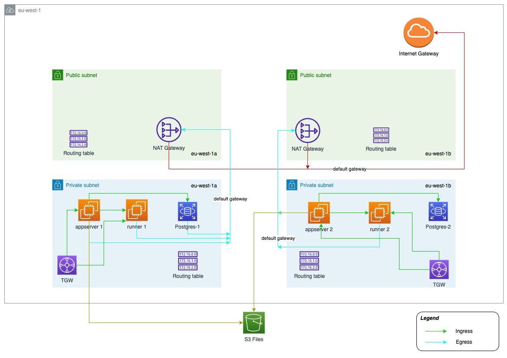

# Terraform Demo

## Description

Terraform module development project used in my blog post.

## Architecture

Description in my blog post.



## Notes

- The approach for this demo project is to structure these modules via permission boundaries among traditional teams rather than actual objects in AWS.
- Start small and iterate - the modules start off with minimal features and would eventually evolve to include features like enforcing standards, logging, and security compliance.
- The best practice for module development is to develop and build the modules in separate repositories, but for this demo I have added them to this repository along with the consumer.

  Modules:
  
  ```bash
  guerzon:terraform-modules-demo guerzon$ tree modules/
  modules/
  |-- terraform-aws-network
  |   |-- README.md
  |   |-- gateways.tf
  |   |-- main.tf
  |   |-- outputs.tf
  |   |-- routing.tf
  |   |-- subnets.tf
  |   `-- variables.tf
  |-- terraform-aws-security
  |   |-- README.md
  |   |-- main.tf
  |   |-- outputs.tf
  |   `-- variables.tf
  |-- terraform-aws-servers
  |   |-- README.md
  |   |-- appservers.tf
  |   |-- main.tf
  |   |-- outputs.tf
  |   |-- runners.tf
  |   `-- variables.tf
  `-- terraform-aws-storage
      |-- README.md
      |-- main.tf
      |-- outputs.tf
      |-- s3.tf
      `-- variables.tf
  
  5 directories, 22 files
  guerzon:terraform-modules-demo guerzon$
  ```
  
  The consumer is [main.tf](./main.tf) and calls 3 customer environments:
  
  ```bash
  guerzon:terraform-modules-demo guerzon$ tree customers/
  customers/
  |-- customer1-dev
  |   `-- main.tf
  |-- customer1-prod
  |   `-- main.tf
  `-- customer2-prod
      `-- main.tf
  
  4 directories, 3 files
  guerzon:terraform-modules-demo guerzon$
  ```

|Name|Purpose|
|---|---|
|[terraform-aws-network](./modules/terraform-aws-network/)|network module|
|[terraform-aws-security](./modules/terraform-aws-security/)|security module|
|[terraform-aws-servers](./modules/terraform-aws-servers/)|server module for app servers|
|[terraform-aws-storage](./modules/terraform-aws-storage/)|storage module for RDS and s3|

## Documentation

Module documentations were written using [terraform-docs](https://github.com/terraform-docs/terraform-docs).

## Contact

Email me at [guerzon@proton.me](mailto:guerzon@proton.me).
